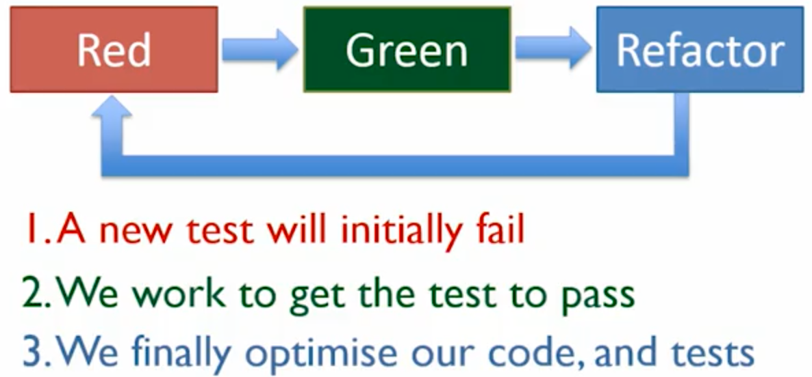
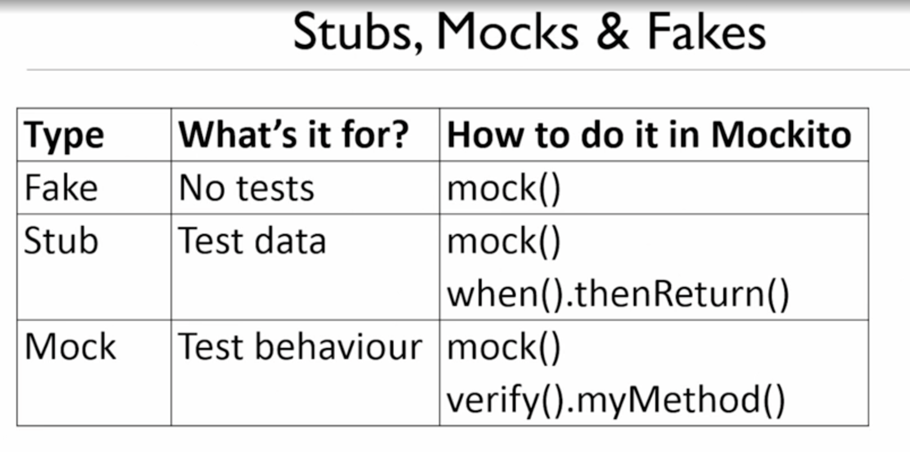

# ISBN-Validator

The International Standard Book Number (ISBN) is a numeric commercial book identifier which is intended to be unique. Publishers purchase ISBNs from an affiliate of the International ISBN Agency. - Wikipedia

This little project was implemented following the ISBN rules as ISBN-10 check digits and ISBN-13 check digit calculation using principally Java with test-driven development (TDD).

# Test-Driven Development (TDD)

# Fakes, Stubs & Mocks test

